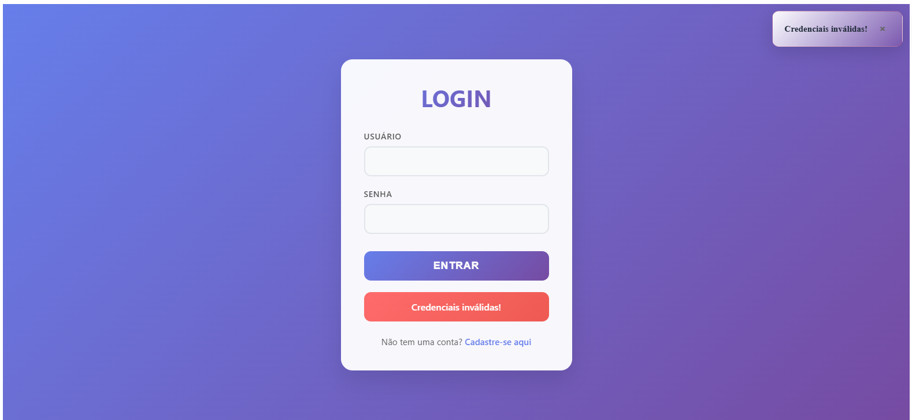
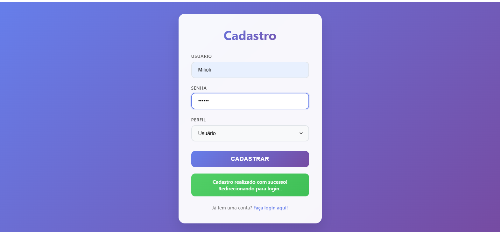
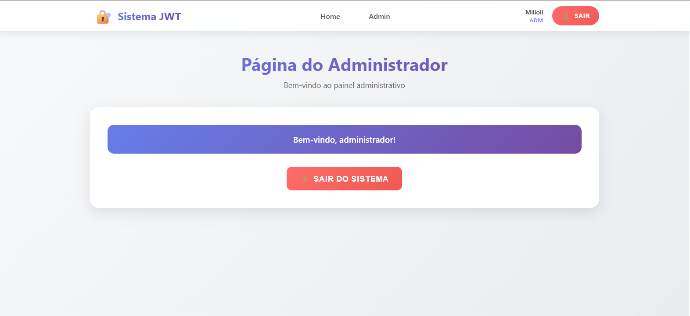
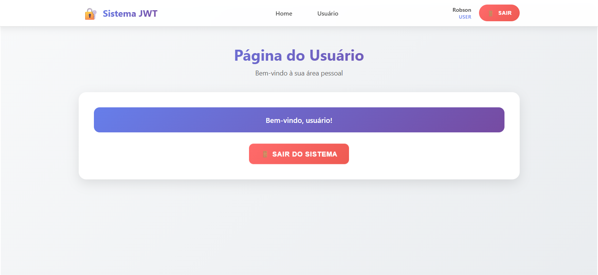
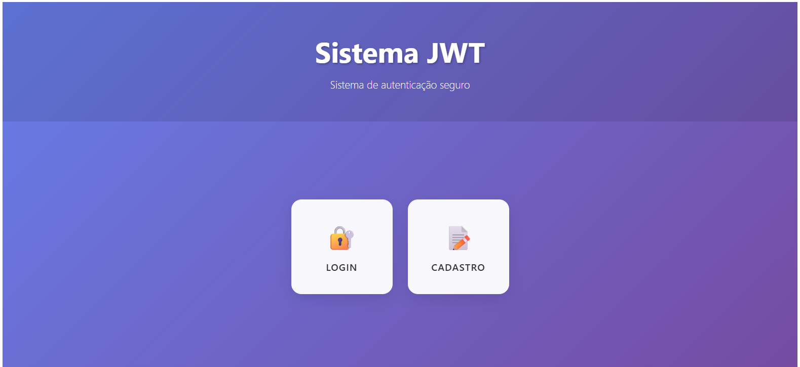

# 🔐 Sistema JWT - Autenticação Segura

<div align="center">



**Sistema completo de autenticação JWT com Angular e Node.js**

[](https://angular.io/)
[](https://nodejs.org/)
[](https://expressjs.com/)
[](https://www.mysql.com/)
[](https://jwt.io/)

</div>

---

## 📋 Índice

- [🎯 Sobre o Projeto](#-sobre-o-projeto)
- [✨ Funcionalidades](#-funcionalidades)
- [🛠️ Tecnologias Utilizadas](#️-tecnologias-utilizadas)
- [🚀 Como Executar](#-como-executar)
- [📱 Screenshots](#-screenshots)
- [🏗️ Arquitetura](#️-arquitetura)
- [🔧 Configuração](#-configuração)
- [📦 Estrutura do Projeto](#-estrutura-do-projeto)
- [🤝 Contribuição](#-contribuição)
- [📄 Licença](#-licença)

---

## 🎯 Sobre o Projeto

O **Sistema JWT** é uma aplicação completa de autenticação que demonstra as melhores práticas de segurança usando JSON Web Tokens (JWT). O projeto inclui um frontend moderno em Angular e um backend robusto em Node.js/Express.

### 🎨 Características Principais

- **🔐 Autenticação Segura**: Sistema de login/registro com JWT
- **👥 Controle de Acesso**: Diferentes perfis (ADM/USER) com rotas protegidas
- **🎯 Interface Moderna**: Design responsivo com glassmorphism
- **📱 Sistema de Alertas**: Notificações em tempo real
- **🛡️ Guards de Rota**: Proteção de páginas baseada em perfil
- **💾 Persistência**: Tokens armazenados no localStorage

---

## ✨ Funcionalidades

### 🔑 Autenticação
- ✅ **Registro de Usuários**: Cadastro com validação
- ✅ **Login Seguro**: Autenticação com JWT
- ✅ **Logout**: Remoção segura de tokens
- ✅ **Controle de Sessão**: Verificação automática de login

### 👥 Gerenciamento de Perfis
- ✅ **Perfil ADM**: Acesso completo ao sistema
- ✅ **Perfil USER**: Acesso limitado
- ✅ **Redirecionamento Inteligente**: Baseado no perfil do usuário

### 🎨 Interface do Usuário
- ✅ **Design Responsivo**: Funciona em desktop e mobile
- ✅ **Sistema de Alertas**: Notificações elegantes
- ✅ **Navegação Intuitiva**: Menu global com informações do usuário
- ✅ **Animações Suaves**: Transições e efeitos visuais

---

## 🛠️ Tecnologias Utilizadas

### Frontend
- **Angular 17** - Framework principal
- **TypeScript** - Linguagem de programação
- **CSS3** - Estilização moderna com glassmorphism
- **RxJS** - Programação reativa
- **Angular Router** - Navegação e guards

### Backend
- **Node.js** - Runtime JavaScript
- **Express.js** - Framework web
- **MySQL** - Banco de dados
- **JWT** - Autenticação e autorização
- **bcrypt** - Hash de senhas
- **CORS** - Cross-Origin Resource Sharing

### Ferramentas
- **Angular CLI** - Desenvolvimento
- **Nodemon** - Hot reload do servidor
- **pgAdmin** - Gerenciamento do banco

---

## 🚀 Como Executar

### Pré-requisitos
- Node.js (versão 18 ou superior)
- MySQL
- Angular CLI

### 1. Clone o Repositório
```bash
git clone https://github.com/seu-usuario/sistema-jwt.git
cd sistema-jwt
```

### 2. Configuração do Backend
```bash
# Instalar dependências
npm install

# Configurar variáveis de ambiente
cp .env.example .env
# Editar .env com suas configurações

# Iniciar servidor
npm run dev
```

### 3. Configuração do Frontend
```bash
cd frontend/site-jwt

# Instalar dependências
npm install

# Iniciar aplicação
ng serve
```

### 4. Acessar a Aplicação
- **Frontend**: http://localhost:4200
- **Backend**: http://localhost:3049

---

## 📱 Screenshots

### 🏠 Página Inicial

*Tela de boas-vindas com navegação para login e registro*

### 🔐 Página de Login

*Interface de login com design moderno e responsivo*

### 📝 Página de Registro

*Formulário de cadastro com seleção de perfil*

### 🎯 Dashboard com Menu

*Interface principal com menu global e sistema de alertas*

---

## 🏗️ Arquitetura

### Frontend (Angular)
```
src/
├── app/
│   ├── components/
│   │   └── alert/           # Sistema de notificações
│   ├── pages/
│   │   ├── home/           # Página inicial
│   │   ├── login/          # Autenticação
│   │   ├── register/       # Cadastro
│   │   ├── admin/          # Área administrativa
│   │   ├── user/           # Área do usuário
│   │   └── menu/           # Menu global
│   ├── services/
│   │   ├── auth.service.ts # Serviço de autenticação
│   │   ├── token.service.ts # Gerenciamento de tokens
│   │   └── alert.service.ts # Sistema de alertas
│   └── guards/
│       └── auth.guard.ts   # Proteção de rotas
```

### Backend (Node.js/Express)
```
├── controllers/
│   └── authController.js   # Lógica de autenticação
├── middleware/
│   └── authMiddleware.js   # Verificação de JWT
├── routes/
│   └── authRoutes.js       # Rotas da API
├── database/
│   └── connection.js       # Conexão MySQL
└── server.js              # Servidor principal
```

---

## 🔧 Configuração

### Variáveis de Ambiente (.env)
```env
# Servidor
PORT=3049

# Banco de Dados
DB_HOST=localhost
DB_USER=seu_usuario
DB_PASSWORD=sua_senha
DB_NAME=sistema_jwt

# JWT
JWT_SECRET=sua-chave-secreta-super-segura

# CORS
CORS_ORIGIN=http://localhost:4200
```

### Estrutura do Banco de Dados
```sql
CREATE TABLE usuarios (
    id INT AUTO_INCREMENT PRIMARY KEY,
    usuario VARCHAR(50) UNIQUE NOT NULL,
    senha VARCHAR(255) NOT NULL,
    perfil ENUM('ADM', 'USER') DEFAULT 'USER',
    created_at TIMESTAMP DEFAULT CURRENT_TIMESTAMP
);
```

---

## 📦 Estrutura do Projeto

```
sistema-jwt/
├── frontend/
│   └── site-jwt/
│       ├── src/
│       │   ├── app/
│       │   │   ├── components/
│       │   │   ├── pages/
│       │   │   ├── services/
│       │   │   └── guards/
│       │   ├── assets/
│       │   └── styles/
│       ├── package.json
│       └── angular.json
├── backend/
│   ├── controllers/
│   ├── middleware/
│   ├── routes/
│   ├── database/
│   ├── package.json
│   └── server.js
├── img/
│   ├── image.png
│   ├── image1.png
│   ├── image2.png
│   ├── image3.png
│   └── image4.png
└── README.md
```

---

## 🎨 Sistema de Alertas

O projeto inclui um sistema de notificações elegante com:

- **🎯 Tipos de Alerta**: Success, Error, Warning, Info
- **⏰ Auto-remoção**: Alertas temporários
- **🎨 Design Moderno**: Glassmorphism com animações
- **📱 Responsivo**: Adaptação para mobile
- **🔧 Configurável**: Duração e tipos personalizáveis

### Exemplo de Uso
```typescript
// Alerta de sucesso temporário
this.alertsService.success('Operação realizada com sucesso!', 3000);

// Alerta de erro
this.alertsService.error('Erro ao processar requisição', 5000);

// Alerta informativo
this.alertsService.info('Informação importante', 4000);
```

---

## 🔐 Segurança

### Implementações de Segurança
- ✅ **JWT Tokens**: Autenticação stateless
- ✅ **Hash de Senhas**: bcrypt para criptografia
- ✅ **CORS Configurado**: Controle de origens
- ✅ **Validação de Dados**: Sanitização de inputs
- ✅ **Guards de Rota**: Proteção de páginas
- ✅ **Expiração de Tokens**: Renovação automática

### Boas Práticas
- 🔒 Tokens armazenados no localStorage
- 🔒 Verificação de perfil em cada rota
- 🔒 Logout automático em token expirado
- 🔒 Validação de dados no frontend e backend

---

## 🤝 Contribuição

1. **Fork** o projeto
2. **Crie** uma branch para sua feature (`git checkout -b feature/AmazingFeature`)
3. **Commit** suas mudanças (`git commit -m 'Add some AmazingFeature'`)
4. **Push** para a branch (`git push origin feature/AmazingFeature`)
5. **Abra** um Pull Request

### Padrões de Código
- Use **TypeScript** para o frontend
- Siga as **convenções do Angular**
- Mantenha o código **limpo e documentado**
- Teste suas funcionalidades

---

## 📄 Licença

Este projeto está sob a licença **MIT**. Veja o arquivo [LICENSE](LICENSE) para mais detalhes.

---

## 👨‍💻 Autor

**Seu Nome**
- GitHub: [@seu-usuario](https://github.com/seu-usuario)
- LinkedIn: [Seu LinkedIn](https://linkedin.com/in/seu-perfil)
- Email: seu-email@exemplo.com

---

<div align="center">

**⭐ Se este projeto te ajudou, considere dar uma estrela!**

[](https://github.com/seu-usuario/sistema-jwt)
[](https://github.com/seu-usuario/sistema-jwt)

</div>
# site-jwt

